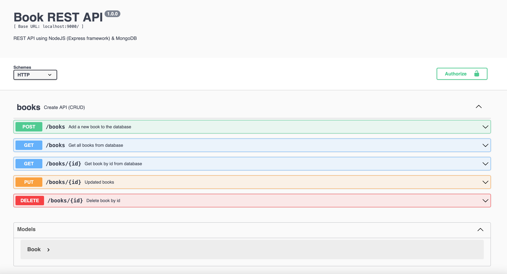

# book-express

## Installation
For use with [node](http://nodejs.org) and [npm](https://npmjs.com):
```sh
npm install
```
### Dockerfile
For use with [image](https://hub.docker.com/repository/docker/nuea/book-express)

### Docker-compose
```sh
docker-compose up
```

## API Document
After running the server You will see the API documentation on [Swagger](http://localhost:9000/swagger/)

